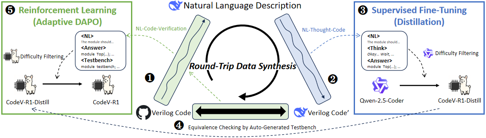

# CodeV-R1: Reasoning-Enhanced Verilog Generation



CodeV-R1 is an innovative open-source Large Language Model (LLM) specifically designed for the generation of high-quality Verilog code, addressing the challenges faced by existing models in this domain.

We have open-sourced our code for model testing, SFT and RL training. In the meantime, we have also open-sourced our SFT and RL training data in Huggingface. Below are the links:

- Webpage: https://iprc-dip.github.io/CodeV-R1/

- Paper: [CodeV-R1: Reasoning-Enhanced Verilog Generation](https://arxiv.org/abs/2505.24183)

- Models: [CodeV-R1](https://huggingface.co/zhuyaoyu/CodeV-R1-Qwen-7B) and [CodeV-R1-distill](https://huggingface.co/zhuyaoyu/CodeV-R1-Distill-Qwen-7B)

- Data: [CodeV-R1-dataset](https://huggingface.co/datasets/zhuyaoyu/CodeV-R1-dataset)

## Environments

Below are the packages needed for (testing of) CodeV-R1.

```bash
conda create -n codev-r1 python=3.10 conda-forge::yosys conda-forge::iverilog
conda activate codev-r1

pip install vllm
# VerilogEval v1
pip install -e testbench/VerilogEval_v1.0.0/
# VerilogEval v2
pip install langchain langchain-community langchain-core langchain-nvidia-ai-endpoints langchain-openai langchain-text-splitters langsmith
```

For the environment of reinforcement learning, please refer to `verl/README.md`.

## Testing

Here is the link for our [CodeV-R1-distill-7B](https://huggingface.co/zhuyaoyu/CodeV-R1-Distill-Qwen-7B) and [CodeV-R1](https://huggingface.co/zhuyaoyu/CodeV-R1-Qwen-7B). Please refer to the README under `test/` for details for testing.

## SFT Training

We use LLaMA-Factory to conduct SFT training, and we provide our training configuration in `sft/`. Please refer to `sft/README.md` for more details.

## RL Training

We use verl to conduct RL training, and we open-source our RL training code in `verl/`. Please refer to `verl/README.md` for more details.

## Citation

**Arxiv:** https://arxiv.org/abs/2505.24183

Please cite the paper if you use the code, models or datasets from CodeV-R1.

```latex
@misc{zhu2025codevr1,
  title={CodeV-R1: Reasoning-Enhanced Verilog Generation}, 
  author={Yaoyu Zhu and Di Huang and Hanqi Lyu and Xiaoyun Zhang and Chongxiao Li and Wenxuan Shi and Yutong Wu and Jianan Mu and Jinghua Wang and Yang Zhao and Pengwei Jin and Shuyao Cheng and Shengwen Liang and Xishan Zhang and Rui Zhang and Zidong Du and Qi Guo and Xing Hu and Yunji Chen},
  year={2025},
  eprint={2505.24183},
  archivePrefix={arXiv},
  primaryClass={cs.LG},
  url={https://arxiv.org/abs/2505.24183}, 
}
```

## Acknowledgements

[DeepSeek-R1](https://github.com/deepseek-ai/DeepSeek-R1): Source model for distillation and reference method for RL

[vllm](https://github.com/vllm-project/vllm): Fast LLM inference during testing

[LLaMA-Factory](https://github.com/hiyouga/LLaMA-Factory): Code for supervised fine-tuning

[verl](https://github.com/volcengine/verl): Code for reinforcement learning

[VerilogEval](https://github.com/NVlabs/verilog-eval) & [RTLLM](https://github.com/hkust-zhiyao/RTLLM): Benchmarks for testing


